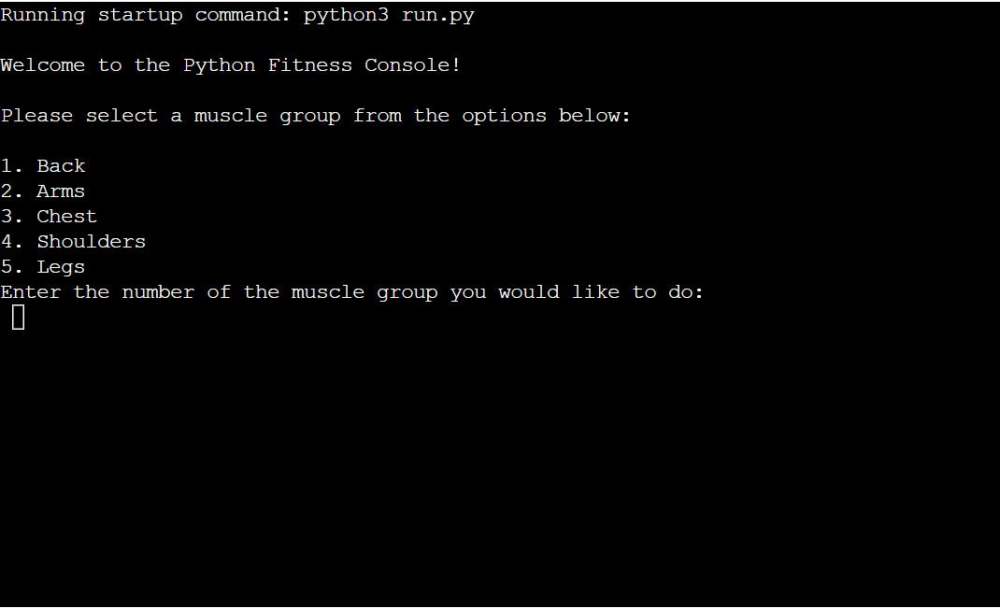

# The Python Fitness Console

***
The Python Fitness Console is for every gym lover who like to track there progress and have a interactive console that increases repititons and weights set by the user automatically every week inline with muslce growth. The program works by understanding if the user had already used one of the 5 muslce groups before, if its the first time the program will ask the user what are their desired starting weights and repetitions they would like, and then saves this information in a google sheet. When a week has passed and the program detects this with "datetime" the reps and weights are incremented.

This is the *[Live version of my project](https://pythonfitnessconsole-3375f331b895.herokuapp.com/)*.

## Features
***

Included workouts:

1. Back
    1. Rear Delt Flys
    2. Lat Pulldowns
    3. Seated Rows
    4. Assisted Pull-Up
    5. Back Extension
2. Arms
    1. Bicep Curls
    2. Seated Dips
    3. Rope Pulldowns
    4. Rope Pullups
    5. Tricep Extension
3. Chest
    1. Chest Press
    2. Chest Flys(high)
    3. Seated Dips
    4. Chest Flys(low)
    5. Pec Deck
4. Shoulders
    1. Shoulder Press
    2. Lateral Raise
    3. Front Raise
    4. Rear Delt Row
    5. Arnold Press
5. Legs
    1. Squat Rack
    2. Leg Extensions
    3. Leg Curls
    4. Calf Raises
    5. Leg Press

#### Walkthrough

1. Asks the user what muscle group they would like to train today, chosen by entering the corresponding index number

